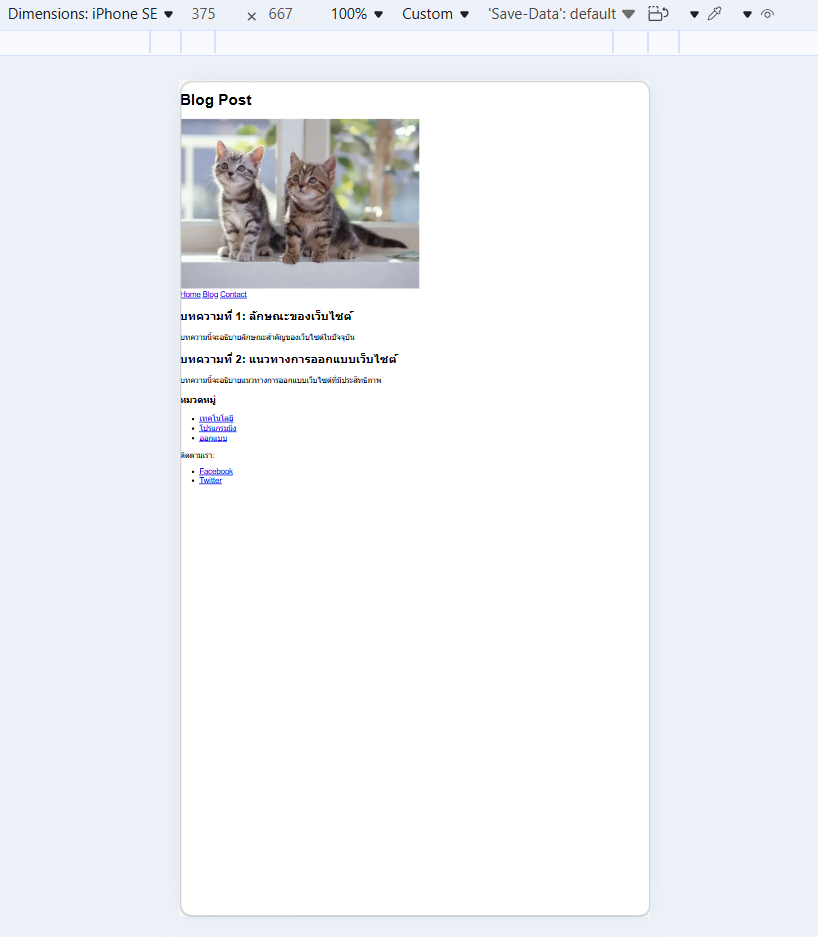
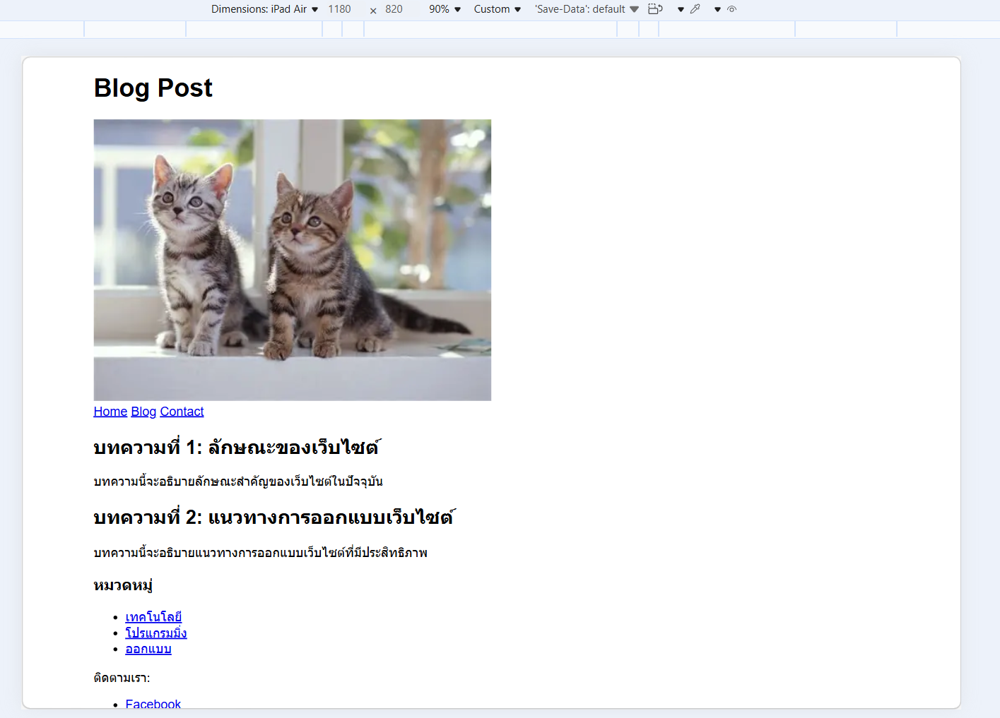
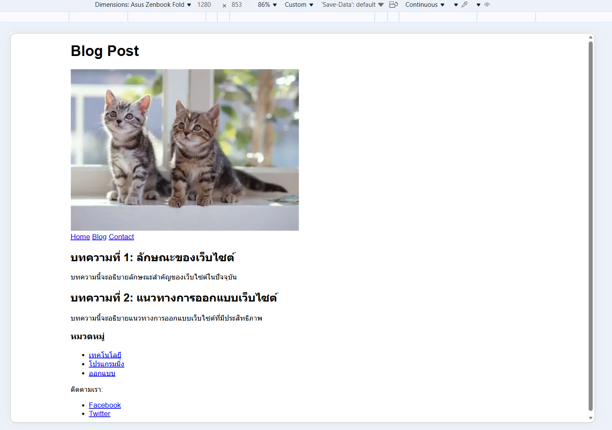

# ข้อที่ 3 Responsive Design และ CSS

### อธิบายหลักการ Mobile-First Approach ในการออกแบบเว็บไซต์ รวมถึง การใช้ Media Queries ยกตัวอย่าง CSS code ที่แสดงวิธีการปรับการแสดงผลสำหรับ mobile (320px), tablet (768px), และ desktop (1024px) เพื่อให้เว็บไซต์สามารถแสดงผลได้ดีบนอุปกรณ์ต่างๆ

#### Mobile-First Approach คือ

การออกแบบเว็บไซต์โดยเริ่มจากหน้าจอมือถือก่อน แล้วค่อยขยายไป Tablet และ Desktop

- เริ่มเขียน CSS สำหรับ หน้าจอเล็ก (mobile) ก่อน
  ใช้ Media Queries เพิ่ม style สำหรับหน้าจอที่ใหญ่ขึ้น
  ทำให้เว็บโหลดเร็ว และใช้งานดีบนมือถือ

---

#### Media Queries คือ

คือคำสั่งใน CSS ที่ใช้กำหนด style ตามขนาดหน้าจอ

```html
<!doctype html>
<html lang="th">
  <head>
    <meta charset="UTF-8" />
    <title>Blog Post</title>
    <!-- ลิงค์ไปยังไฟล์ style.css -->
    <link rel="stylesheet" href="style.css" />
  </head>
  <body>
    <header>
      <h1>Blog Post</h1>
      
      <nav>
        <a href="#">Home</a>
        <a href="#">Blog</a>
        <a href="#">Contact</a>
      </nav>
    </header>

    <main>
      <section>
        <article>
          <h2>บทความที่ 1: ลักษณะของเว็บไซต์</h2>
          <p>บทความนี้จะอธิบายลักษณะสำคัญของเว็บไซต์ในปัจจุบัน</p>
        </article>

        <article>
          <h2>บทความที่ 2: แนวทางการออกแบบเว็บไซต์</h2>
          <p>บทความนี้จะอธิบายแนวทางการออกแบบเว็บไซต์ที่มีประสิทธิภาพ</p>
        </article>
      </section>
    </main>

    <aside>
      <h3>หมวดหมู่</h3>
      <ul>
        <li><a href="#">เทคโนโลยี</a></li>
        <li><a href="#">โปรแกรมมิ่ง</a></li>
        <li><a href="#">ออกแบบ</a></li>
      </ul>
    </aside>

    <footer>
      <p>ติดตามเรา:</p>
      <nav>
        <ul>
          <li><a href="#">Facebook</a></li>
          <li><a href="#">Twitter</a></li>
        </ul>
      </nav>
    </footer>
  </body>
</html>
```

---

#### ตัวอย่าง css

```css
/* Mobile (เริ่มต้น 320px) */
body {
  font-family: Arial;
  margin: 0;
}

.container {
  display: flex;
  flex-direction: column; /* เรียงแนวตั้ง */
}

.content,
.sidebar {
  padding: 10px;
}

/* Tablet (768px ขึ้นไป) */
@media (min-width: 768px) {
  .container {
    flex-direction: row; /* เรียงแนวนอน */
  }

  .content {
    flex: 2;
  }

  .sidebar {
    flex: 1;
  }
}

/* Desktop (1024px ขึ้นไป) */
@media (min-width: 1024px) {
  body {
    max-width: 1000px;
    margin: auto;
  }

  .content {
    flex: 3;
  }

  .sidebar {
    flex: 1;
  }
}
```

---

#### รูปหน้าจอที่แสดงผลในขนาดหน้าจอที่แตกต่างกัน

mobile


ipad


desktop

