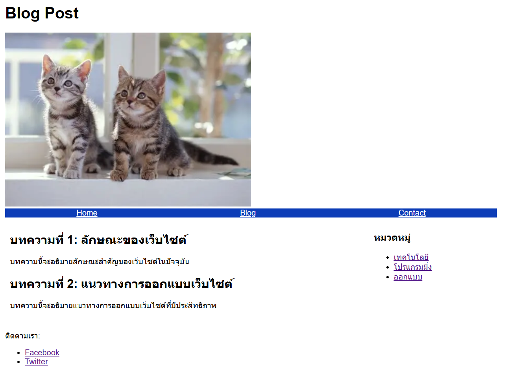
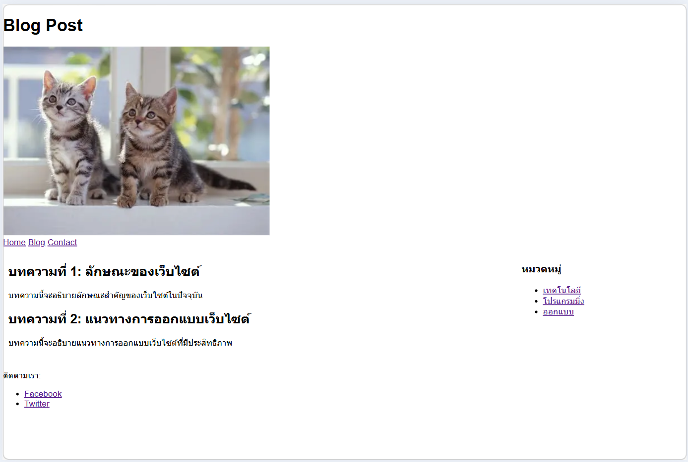

# ข้อที่ 4 Flexbox และ Grid Layout

### เปรียบเทียบความแตกต่างระหว่าง CSS Flexbox และ CSS Grid พร้อมยกตัวอย่าง use cases ที่เหมาะสมสำหรับการใช้งานแต่ละเทคนิค (เช่น Flexbox เหมาะสำหรับ navigation bar, Grid เหมาะสำหรับ page layout)

#### เปรียบเทียบ Flexbox vs Grid

**CSS Flexbox**

เป็น layout 1 มิติ (1D) → จัดแค่ “แถว หรือ คอลัมน์”
เหมาะกับการจัด element **ในแนวเดียว**

- Use case: Navigation bar, ปุ่มเรียงกัน, จัด element ให้อยู่กลาง

**CSS Grid**

เป็น layout 2 มิติ (2D) → จัด “แถว + คอลัมน์”
เหมาะกับ layout **หน้าเว็บทั้งหน้า**

- Use case:Page layout (header / sidebar / content / footer)

---

#### ตัวอย่าง Flexbox (Navbar)

```html
<nav class="nav">
  <a href="#">Home</a>
  <a href="#">Blog</a>
  <a href="#">Contact</a>
</nav>
```

```css
.nav {
  display: flex;
  justify-content: space-around;
  background: #333;
}

.nav a {
  color: white;
}
```

---

#### ตัวอย่าง Grid (Page Layout)

```css
.container {
  display: grid;
  grid-template-columns: 1fr; /* mobile */
  gap: 10px;
}

@media (min-width: 768px) {
  .container {
    grid-template-columns: 2fr 1fr; /* tablet */
  }
}

@media (min-width: 1024px) {
  .container {
    grid-template-columns: 3fr 1fr; /* desktop */
  }
}
```

---

#### รูปหน้าจอที่แสดงผล

Flexbox


Grid

