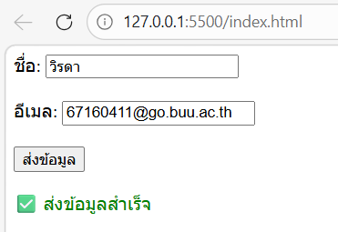
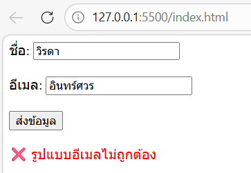
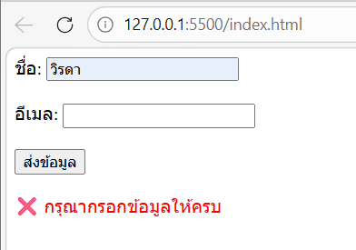

# ข้อที่ 5 JavaScript และ DOM Manipulation

### เขียนโค้ด JavaScript ที่อ่านค่าจากฟอร์มที่มี input field สำหรับ ชื่อ และอีเมล จากนั้น validate ข้อมูล ตรวจสอบว่าไม่เว้นว่าง, อีเมล format ถูกต้อง และแสดงข้อความ error หรือ success ( ห้ามใช้ alert() ) พร้อมอธิบายโค้ดโดยเขียน comment

```html
<!DOCTYPE html>
<html lang="th">
  <head>
    <meta charset="UTF-8" />
    <title>Form Validation</title>
  </head>
  <body>
    <!-- ฟอร์มรับข้อมูลชื่อและอีเมล -->
    <form id="myForm">
      <!-- input สำหรับชื่อ -->
      <label>ชื่อ:</label>
      <input type="text" id="name" />
      <br /><br />

      <!-- input สำหรับอีเมล -->
      <label>อีเมล:</label>
      <input type="text" id="email" />
      <br /><br />

      <!-- ปุ่ม submit -->
      <button type="submit">ส่งข้อมูล</button>
    </form>

    <!-- แสดงข้อความ error หรือ success -->
    <p id="message"></p>

    <script>
      // ดึง form มาใช้งาน
      const form = document.getElementById("myForm");

      // เมื่อกด submit
      form.addEventListener("submit", function (event) {
        event.preventDefault(); // ป้องกันหน้ารีเฟรช

        // ดึงค่าจาก input
        const name = document.getElementById("name").value;
        const email = document.getElementById("email").value;

        // ดึงตำแหน่งแสดงข้อความ
        const message = document.getElementById("message");

        // ตรวจสอบว่าเว้นว่างหรือไม่
        if (name === "" || email === "") {
          message.textContent = "❌ กรุณากรอกข้อมูลให้ครบ";
          message.style.color = "red";
          return;
        }

        // ตรวจสอบ format email ด้วย regex
        const emailPattern = /^[^ ]+@[^ ]+\.[a-z]{2,3}$/;

        if (!email.match(emailPattern)) {
          message.textContent = "❌ รูปแบบอีเมลไม่ถูกต้อง";
          message.style.color = "red";
          return;
        }

        // ถ้าผ่านทุกเงื่อนไข
        message.textContent = "✅ ส่งข้อมูลสำเร็จ";
        message.style.color = "green";
      });
    </script>
  </body>
</html>
```

---

#### อธิบาย

- ใช้ <form> สำหรับรับข้อมูลจากผู้ใช้ (ชื่อ + อีเมล)
- ใช้ getElementById() เพื่อดึงค่าจาก input
- ใช้ addEventListener("submit") เพื่อจับ event ตอนกดปุ่มส่ง
- ใช้ event.preventDefault() เพื่อไม่ให้หน้า reload
- ตรวจสอบ: ถ้าว่าง → แสดง error, ถ้า email format ผิด → แสดง error
- ใช้ Regex เช็คอีเมล
- แสดงผลผ่าน <p id="message"> แทน alert()

---

#### รูปหน้าจอที่แสดงผล

Correct


Error



#### ถาม AI ตรวจสอบ format email ด้วย regex ต้องเขียนยังไงในโค้ดนี้

const emailPattern = /^[^ ]+@[^ ]+\.[a-z]{2,3}$/;
