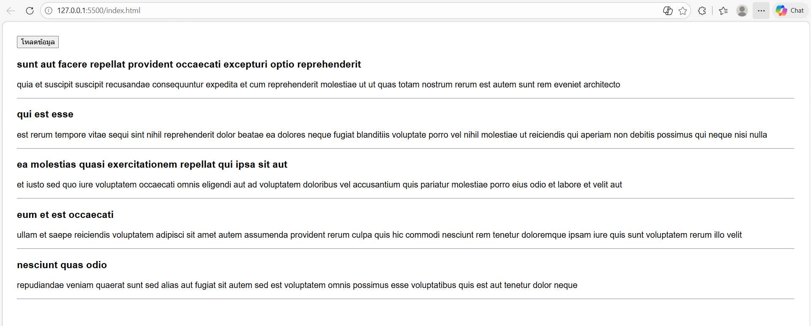

# ข้อที่ 6 Async/Await และ Fetch API

### เขียนฟังก์ชัน async ที่ใช้ Fetch API เพื่อดึงข้อมูลจาก public API (เช่น JSONPlaceholder) โดยต้องมี error handling (try-catch) และแสดง loading state ขณะรอข้อมูล และอธิบายว่า Async/Await มีข้อดีอะไรเมื่อเทียบกับ Promise .then()

ใช้ API จาก https://jsonplaceholder.typicode.com/posts

```html
<!DOCTYPE html>
<html lang="th">
  <head>
    <meta charset="UTF-8" />
    <title>Fetch API</title>

    <style>
      body {
        font-family: Arial;
        padding: 20px;
      }

      #result {
        margin-top: 20px;
      }

      #loading {
        color: blue;
      }

      .error {
        color: red;
      }
    </style>
  </head>
  <body>
    <button onclick="getPosts()">โหลดข้อมูล</button>

    <p id="loading"></p>

    <div id="result"></div>

    <script>
      // ฟังก์ชัน async สำหรับดึงข้อมูลจาก API
      async function getPosts() {
        // ดึง element มาใช้งาน
        const loading = document.getElementById("loading");
        const result = document.getElementById("result");

        loading.textContent = "⏳ กำลังโหลดข้อมูล...";
        result.innerHTML = "";

        try {
          const response = await fetch(
            "https://jsonplaceholder.typicode.com/posts",
          );

          if (!response.ok) {
            throw new Error("เกิดข้อผิดพลาดในการดึงข้อมูล");
          }

          const data = await response.json();

          loading.textContent = "";

          data.slice(0, 5).forEach((post) => {
            const div = document.createElement("div");

            div.innerHTML = `
            <h3>${post.title}</h3>
            <p>${post.body}</p>
            <hr>
          `;

            result.appendChild(div);
          });
        } catch (error) {
          loading.textContent = "";
          result.innerHTML = `<p class="error">❌ ${error.message}</p>`;
        }
      }
    </script>
  </body>
</html>
```

---

#### ข้อดีของ Async/Await เทียบกับ .then()

1. อ่านง่ายกว่า เขียนเหมือนโค้ดปกติ
2. ไม่ต้องซ้อน .then() หลายชั้น
3. ใช้ try...catch จัดการ error ได้ง่าย
4. โค้ดสั้น และดูเป็นระเบียบมากขึ้น

---

#### รูปหน้าจอที่แสดงผล



---

#### ถาม AI ใช้ API จากลิงค์ไหน

คำตอบ: ใช้ API จาก 👉 https://jsonplaceholder.typicode.com/posts
